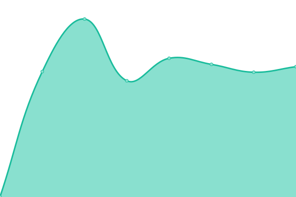

# [📈 Live Status](https://status.sternwarte-ottilien.de): <!--live status--> **🟧 Partial outage**

This repository contains the open-source uptime monitor and status page for [Sternwarte St. Ottilien e. V.](https://sternwarte-ottilien.de), powered by [Upptime](https://github.com/upptime/upptime).

With [Upptime](https://upptime.js.org), you can get your own unlimited and free uptime monitor and status page, powered entirely by a GitHub repository. We use [Issues](https://github.com/Sternwarte-St-Ottilien-e-V/status/issues) as incident reports, [Actions](https://github.com/Sternwarte-St-Ottilien-e-V/status/actions) as uptime monitors, and [Pages](https://status.sternwarte-ottilien.de) for the status page.

<!--start: status pages-->
<!-- This summary is generated by Upptime (https://github.com/upptime/upptime) -->
<!-- Do not edit this manually, your changes will be overwritten -->
<!-- prettier-ignore -->
| URL | Status | History | Response Time | Uptime |
| --- | ------ | ------- | ------------- | ------ |
|  [Website](https://sternwarte-ottilien.de) | 🟥 Down | [website.yml](https://github.com/Sternwarte-St-Ottilien-e-V/status/commits/HEAD/history/website.yml) | 

 705ms
     
 | 

<a href="https://status.sternwarte-ottilien.de/history/website">99.43%</a>
    

|  Mattermost | 🟥 Down | [mattermost.yml](https://github.com/Sternwarte-St-Ottilien-e-V/status/commits/HEAD/history/mattermost.yml) | 

 391ms
     
 | 

<a href="https://status.sternwarte-ottilien.de/history/mattermost">99.44%</a>
    

|  Nextcloud | 🟥 Down | [nextcloud.yml](https://github.com/Sternwarte-St-Ottilien-e-V/status/commits/HEAD/history/nextcloud.yml) | 

 1982ms
     
 | 

<a href="https://status.sternwarte-ottilien.de/history/nextcloud">99.44%</a>
    

|  AllSky | 🟥 Down | [all-sky.yml](https://github.com/Sternwarte-St-Ottilien-e-V/status/commits/HEAD/history/all-sky.yml) | 

 372ms
     
 | 

<a href="https://status.sternwarte-ottilien.de/history/all-sky">99.44%</a>
    

|  Wetter | 🟥 Down | [wetter.yml](https://github.com/Sternwarte-St-Ottilien-e-V/status/commits/HEAD/history/wetter.yml) | 

 737ms
     
 | 

<a href="https://status.sternwarte-ottilien.de/history/wetter">99.44%</a>
    

|  Inventarverwaltung | 🟥 Down | [inventarverwaltung.yml](https://github.com/Sternwarte-St-Ottilien-e-V/status/commits/HEAD/history/inventarverwaltung.yml) | 

 956ms
     
 | 

<a href="https://status.sternwarte-ottilien.de/history/inventarverwaltung">99.45%</a>
    

|  Vereinsverwaltung | 🟥 Down | [vereinsverwaltung.yml](https://github.com/Sternwarte-St-Ottilien-e-V/status/commits/HEAD/history/vereinsverwaltung.yml) | 

 687ms
     
 | 

<a href="https://status.sternwarte-ottilien.de/history/vereinsverwaltung">99.45%</a>
    

|  Tickets | 🟩 Up | [tickets.yml](https://github.com/Sternwarte-St-Ottilien-e-V/status/commits/HEAD/history/tickets.yml) | 

 812ms
     
 | 

<a href="https://status.sternwarte-ottilien.de/history/tickets">100.00%</a>
    

|  Wiki | 🟥 Down | [wiki.yml](https://github.com/Sternwarte-St-Ottilien-e-V/status/commits/HEAD/history/wiki.yml) | 

 878ms
     
 | 

<a href="https://status.sternwarte-ottilien.de/history/wiki">99.45%</a>
    

|  Newsletter | 🟥 Down | [newsletter.yml](https://github.com/Sternwarte-St-Ottilien-e-V/status/commits/HEAD/history/newsletter.yml) | 

 465ms
     
 | 

<a href="https://status.sternwarte-ottilien.de/history/newsletter">99.45%</a>
    

|  Webmail | 🟥 Down | [webmail.yml](https://github.com/Sternwarte-St-Ottilien-e-V/status/commits/HEAD/history/webmail.yml) | 

 563ms
     
 | 

<a href="https://status.sternwarte-ottilien.de/history/webmail">59.60%</a>
    

|  SMTP | 🟩 Up | [smtp.yml](https://github.com/Sternwarte-St-Ottilien-e-V/status/commits/HEAD/history/smtp.yml) | 

 114ms
     
 | 

<a href="https://status.sternwarte-ottilien.de/history/smtp">59.61%</a>
    

|  DNS (Primary Master) | 🟥 Down | [dns-primary-master.yml](https://github.com/Sternwarte-St-Ottilien-e-V/status/commits/HEAD/history/dns-primary-master.yml) | 

 110ms
     
 | 

<a href="https://status.sternwarte-ottilien.de/history/dns-primary-master">0.00%</a>
    

<!--end: status pages-->

[**Visit our status website →**](https://status.sternwarte-ottilien.de)

## 📄 License

- Powered by: [Upptime](https://github.com/upptime/upptime)
- Code: [MIT](./LICENSE) © [Sternwarte St. Ottilien e. V.](https://sternwarte-ottilien.de)
- Data in the `./history` directory: [Open Database License](https://opendatacommons.org/licenses/odbl/1-0/)
